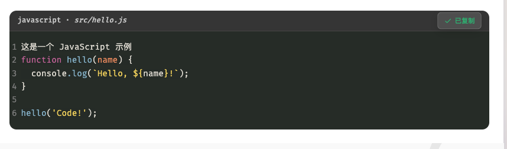
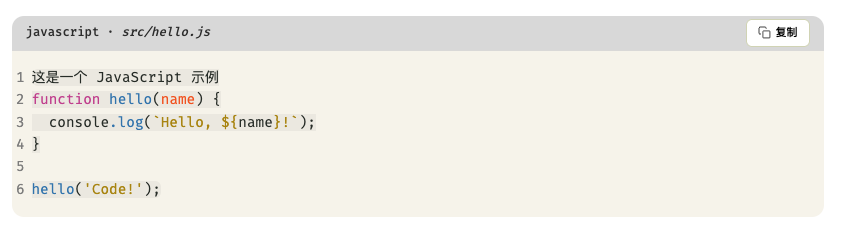

# hexo-shiki-code

为 Hexo 博客提供基于 [Shiki](https://github.com/shikijs/shiki) 的高质量代码高亮，支持多主题、复制按钮、行号显示与主题自定义。

## 功能特性

- 支持 Shiki 所有官方语言高亮
- 支持自定义浅色/深色主题，自动适配系统主题
- 可选代码复制按钮，支持复制提示与动画
- 可选行号显示
- 主题可扩展，支持自定义 JSON 主题文件
- 兼容 Hexo 代码块语法

## 安装方法

```bash
pnpm install --save hexo-shiki-code 

npm install --save hexo-shiki-code
```


## 配置说明

在 Hexo 根目录的 `_config.yml` 中新增 `shiki` 配置项：

```yaml
shiki:
  enable: true
  theme: 'github-light'   # 默认主题，可选任意 Shiki 官方主题 或填写customThemesPath 目录中加载的主题名称
  light: 'github-light'   # 浅色主题
  dark: 'github-dark'     # 深色主题
  customThemesPath: ''    # 自定义主题目录（可选）会自动加载自定义主题
  supportedLangs: []      # 支持的语言数组（可选，默认全部）
  copyButton: true        # 显示复制按钮
  lineNumbers: true       # 显示行号
  # cssPath: 'css/custom-shiki-code.css' # 样式文件路径
```


## 使用自定义主题

1. 将 Shiki 兼容的 JSON 主题文件放入指定目录，并配置 `customThemesPath` 后 会自动加载
2. 在`_config.yml`配置文件中写入 
```
  theme: Chinolor
  light: Chinolor Light
  dark: Chinolor 
```

## 截图



## 感谢
- [Shiki](https://github.com/shikijs/shiki) 
- [Hexo](https://hexo.io/)

